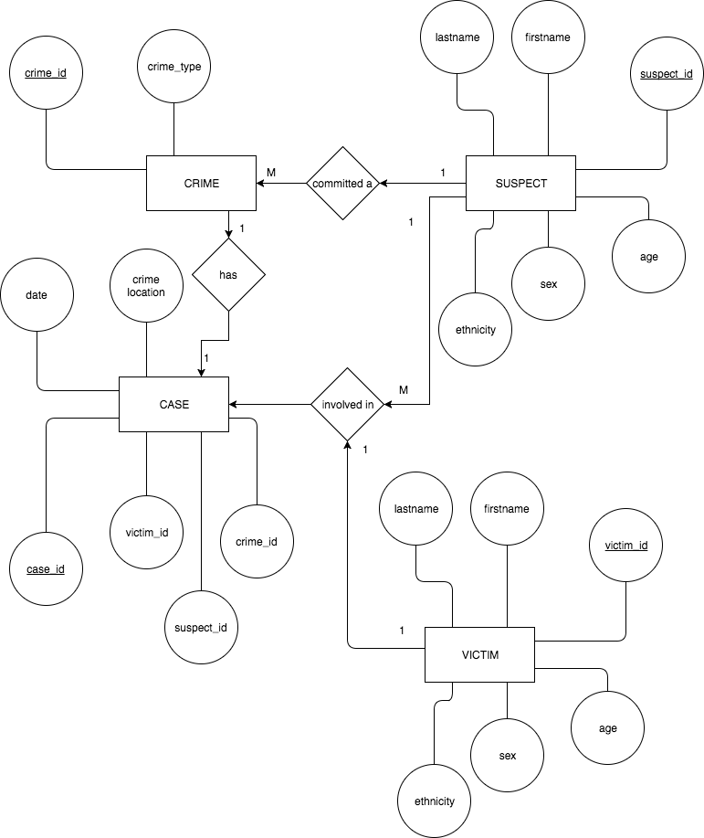

# Detailed Database Design
## 2.1 Project Description
Our database holds case information for the LAPD's murder case files. The data we will be entering into the database pertains to overall case information, crime information, suspect information and victim information. The database acts as an easy and organized way to access relevant case information based on a search by the user. The main users of this application will be a small team of LAPD detectives that require a better way to search for case information. We will be using Neo4j as the main database engine which allows users to look at a simple graph database to access various case information.

## 2.2 Data Description
+ Case
  - case_id: Case entity identifier (Primary Key)
  - crime_id: Crime entity identifier 
  - victim_id: Victim entity identifier
  - suspect_id: Suspect entity identifier
  - crime_location: Location the crime took place
  - date: Date that crime occurred
  
+ Crime
  - crime_id: Crime entity identifier (Primary Key)
  - crime_type: Charge of the crime (Homicide, Robbery, Assault etc.)
  
+ Suspect
  - suspect_id: Suspect entity identifier (Primary Key)
  - firstname: First name of suspect
  - lastname: Last name of suspect
  - ethnicity: Ethnicity of suspect
  - age: Age of suspect
  - sex: Sex or gender of suspect
  
+ Victim
  - victim_id: Victim entity identifier (Primary Key)
  - firstname: First name of victim
  - lastname: Last name of victim
  - ethnicity: Ethnicity of victim
  - age: Age of victim
  - sex: Sex or gender of suspect

 
## 2.3 Entity Relationship Diagram

