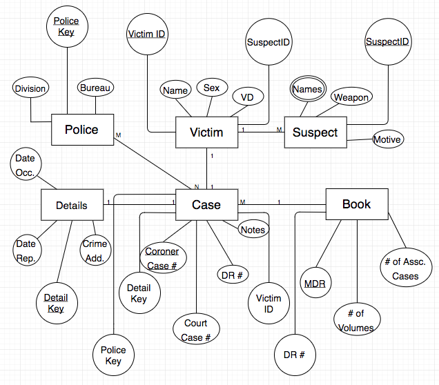

# Preliminary Database Design
## 1.1 Project Description
For our database design, we will be using Neo4j: a native graph database that is built to store, query and manage highly connected data. This will be the first time our team will be using Neo4j. If difficulty follows, we may consider switching to a more familiar DBMS. The users for this database is geared towards LAPD Detectives. It is meant to keep track of their case files. The database will implement the database standards of having the operations associated with CRUD and expectations of following the ACID framework. The database is a part of a web application built off of the Django framework.

## 1.2 Data Description
The data that will be stored is information related to case files. These case files are supplied by the LAPD and pertain to their murder case books. Specifically, the types of data will be strings. These strings encompass information such as: victim names, suspect names, weapons, dates, and other relevant LAPD murder case information.

## 1.3 Examples
##### 1. RETURN ALL CASES AND THEIR GRAPHS
MATCH (n)-[r]->m RETURN n, r, m

##### 2. RETURN ALL SUSPECTS
MATCH (n:Person)-[r:COMMITTED_A]->(m) RETURN n, r, m

##### 3. RETURN CASES WITH A SPECIFIC ATTRIBUTE (first name as an example)
MATCH (c:Case)<-[r:INVOLVED_IN]-(p:Person{first_name:"Alex"}) RETURN c, r, p

##### 4. EDITING AN ATTRIBUTE AND RETURNING THAT NODE
MATCH(n:Person) WHERE n.last_name = "Test2" SET n.last_name = "Kevin"
return n

##### 5. CREATE ONE NODE
CREATE (c:Crime{case_id:'10',crime_type:'Murder',crime_id:'9'})

##### 6. UPDATING A CASE ENTRY WITH A NEW SUSPECT, AND RETURNING THAT CASE'S GRAPH
MATCH (c:Case)<-[]-(m) WHERE c.case_id='2' CREATE
  (p:Person{first_name:"Daniel",last_name:"Sjarif",age:"7",sex",ethnicity:"Asian"})-[r:COMMITTED_A]->(c) RETURN r,c,m

## 1.4 Preliminary Schema
#### Case

|Dr# (PK)|Court Case #| Coroner Case #| Notes          | Detail Key (FK)| Police Key (FK)|VictimID (FK)|
|--------|------------|---------------|----------------|----------------|----------------|-------------|
|2412    | 31231231   | 24795739      |  Example Note  | 0000000001     | 0000000001     |0000024123   |

#### Victim

|VictimID(PK)|Name | Sex | Age | Victim Description | SuspectID(FK)|
|------------|-----|-----|-----|--------------------|--------------|
|0000024123  |Rony | M   | 22  | Glasses and flannel| 39571245     |

#### Suspect

|SuspectID(PK)|Name        |Motive              |
|-------------|------------|--------------------|
|39571245     |Nick        | Robbery            |

#### Police

| Police Key (PK)| Division   | Bureau |
|----------------|------------|--------|
|0000001         | "Southwest" | "OSB" |

#### Detail

|Detail Key (PK)|Crime Address | Date Occurred| Date Reported | Weapon     |
|---------------|------------- |--------------|---------------|------------|
|0000001        |123 Foobar Ave|12/25/16      |12/25/16       | Lorem Ipsum|

#### Book

|Master Dr # (PK)| # of Volumes | # of Associated Cases | Dr # (FK)|
|----------------|--------------|-----------------------|----------|
|92746172        | 1            | 1                     | 2412     |
|94637224/2      | 1            | 2                     | 2471     |

## 1.5 Preliminary ERD for Database

